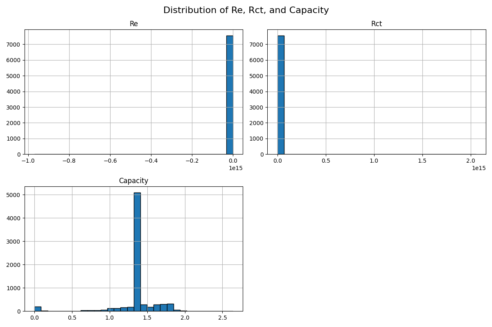
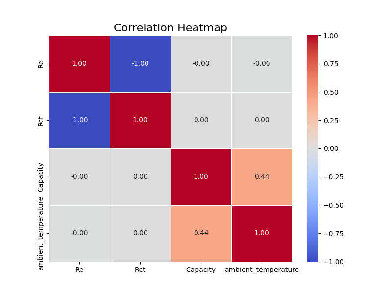

# Battery Performance Analysis

This project focuses on analyzing the performance and aging of Li-ion batteries. Using data collected from multiple experiments, the aim is to understand how different battery parameters change over time, especially during charge/discharge cycles. The key metrics analyzed are:

- **Battery Impedance**
- **Electrolyte Resistance (Re)**
- **Charge Transfer Resistance (Rct)**
- **Battery Capacity**

This analysis helps in understanding battery aging and performance degradation over cycles, which is crucial for applications like electric vehicles, energy storage systems, and portable electronics.

## Key Features

- Data preprocessing: Cleaning and converting columns to the correct formats.
- Data visualization: Using Plotly and Matplotlib for creating dynamic and static visualizations.
- Statistical analysis: Correlation analysis between battery parameters and environmental conditions.
- Easy-to-understand plots showcasing how impedance, resistance, and capacity evolve over time.

## Installation

### Step 1: Download the Dataset from Kaggle

1. Visit the following [Kaggle dataset page](https://www.kaggle.com/datasets/patrickfleith/nasa-battery-dataset/data).
  
2. After downloading, unzip the file to a directory of your choice.

### Step 2: Clone the Repository

Clone this repository to your local machine:

```bash
git clone https://github.com/Jatin-kumar-10/Battery-Performance-Analysis.git
cd Battery-Performance-Analysis
```

### 3. Set the Correct Path for `metadata.csv`

In the `battery_analysis.py` file, update the `metadata.csv` file path to the correct location where you unzipped the dataset.

For example, if you unzipped the dataset in `C:\Users\YourName\Downloads\nasa-battery-data`, update the `file_path` variable in the script as follows:

```python
file_path = r'C:\Users\YourName\Downloads\nasa-battery-data\metadata.csv'
```

### 4. Install Dependencies
The following Python libraries are required to run this project:

- **pandas**
- **plotly**
- **matplotlib**
- **seaborn**

```python
pip install pandas plotly matplotlib seaborn
```

### 5. Run the Analysis Script
After setting up the environment and installing the dependencies, you can run the analysis script as follows:

```python
python battery_analysis.py
```

## Usage

This could plots using plotly and showing how the following battery paramaters :
- Battery_impedance


- Re: Estimated electrolyte resistance (Ohms)


- Rct: Estimated charge transfer resistance (Ohms)


are changing as the battery cell is aging through charge/discharge cycles.






